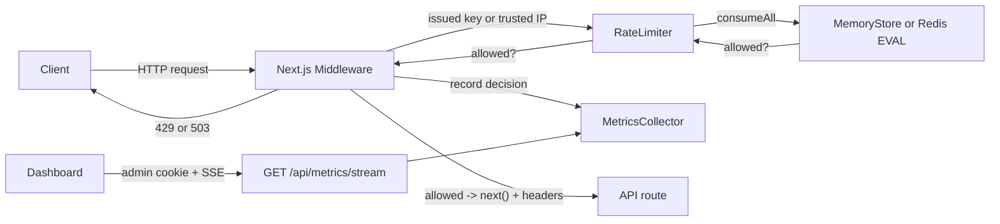

# API Rate Limiter — Project Overview

Last updated: 2026-09-26

How to click through the dashboard: [docs/use-guide.md](docs/use-guide.md). How to run it: [docs/deployment-guide.md](docs/deployment-guide.md).

A small, production-shaped **API rate limiter** built on Next.js. It sits in front of your API routes, counts how many requests each client (IP) makes in a time window, and returns `429 Too Many Requests` once a limit is exceeded. It also records live metrics and renders them in a real-time dashboard.

This document explains **what the project is**, **how it's built**, and **what tools/techniques were used and why**.

---

## What it does

- Enforces per-endpoint request limits (e.g. `/api/ping` = 10/min, `/api/contact` = 3/10min) with fixed-window, token-bucket, or sliding-window.
- Isolates limits by an issued API key, or by a trusted client IP. A missing identity is `400`, not a shared bucket.
- Adds `X-RateLimit-*` headers. `X-RateLimit-Reset` is epoch milliseconds. `Retry-After` is seconds, and the JSON body puts `retryAfter` on `error.details`.
- Tracks live metrics (allowed, blocked, and banned are separate) and streams them to the dashboard over SSE after an admin cookie is set.
- Optional Upstash Redis shares counters, bans, and live config. Store failures return `503`.

---

## Architecture at a glance



**Request flow:**
1. Middleware intercepts every `/api/*` request.
2. It resolves an issued API key or a trusted IP. If neither exists, it returns `400` and does not count the request.
3. Blocklist, allowlist, then a temporary ban are checked. Bans live in memory, or in Redis when Upstash is configured.
4. `RateLimiter` probes every configured window and consumes all of them, or none.
5. Allowed requests continue with rate-limit headers. The metrics row does not pretend the route returned `200`. Denied requests are `429`. A store error is `503`.
6. The dashboard opens `/api/metrics/stream` after `POST /api/admin/session` sets an httpOnly cookie.

---

## Tech stack — what I used and why

| Tool / Technique | Where | Why I used it |
|---|---|---|
| **Next.js 15.5.24 (App Router)** | Whole app | Gives API routes, middleware, and a React frontend in one framework. The version is pinned so `experimental.nodeMiddleware` does not move under a caret range. |
| **Next.js Middleware (Node.js runtime)** | `src/middleware.ts` | Runs before every `/api/*` route. Uses the Node runtime so in-memory counters and metrics are the same objects the route handlers see. |
| **TypeScript** | Entire codebase | `RateLimitStore` is the contract for the memory store and the Redis store. |
| **Three algorithms** | `memory-store.ts`, `scripts.ts` | Fixed-window, token-bucket, and sliding-window. Multi-window limits commit together or not at all. |
| **In-memory `Map` store** | `src/lib/rate-limit/memory-store.ts` | Default single-process store. A timer sweeps expired fixed windows, idle token buckets, and stale sliding timestamps. |
| **Redis `EVAL`** | `redis-store.ts`, `scripts.ts` | One script per check. Fixed windows use `INCR` and `PEXPIRE`. A deny does not write the other windows. |
| **`globalThis` singletons** | `middleware.ts`, `metrics.ts` | One memory store and one metrics collector per process, including across dev hot reload. |
| **`MetricsCollector`** | `src/lib/rate-limit/metrics.ts` | Allowed, blocked, and banned are separate counters. History is capped at 5,000 events plus a 60s window. |
| **React + Recharts** | `src/app/page.tsx` | Dashboard subscribes to SSE after the admin cookie is set, and falls back to polling if the stream drops. |
| **Consistent response envelope** | `src/lib/api-response.ts` | `429` bodies use `error.details.retryAfter`, including the middleware response. |
| **Config table** | `config.ts`, `config-store.ts` | Static defaults plus a live store. With Redis, the snapshot is `rl:config` and readers cache it for about a second. |
| **Vitest** | `test/` | Memory algorithms, Redis concurrency against a fake `EVAL`, admin-key rejection, and fail-closed middleware. |
| **Admin secret** | `admin-auth.ts` | `ADMIN_RESET_KEY` is required. Comparison is SHA-256 plus `timingSafeEqual`. Reads and writes both require it. |

---

## Key design decisions (the "why" behind the shape)

- **Rate limiting in middleware, not in each route.** One guardrail covers all endpoints; route handlers stay focused on business logic and never run when a request is blocked.
- **Node.js middleware runtime.** By default Next.js runs middleware in an isolated Edge runtime that can't share memory with Node route handlers — which would make the metrics singleton always read empty. Enabling `experimental.nodeMiddleware` + `runtime: "nodejs"` puts middleware and routes in the same process so they share the same counters and metrics.
- **Rate-limit headers set on the response, not the forwarded request.** `NextResponse.next({ request: { headers } })` only rewrites headers sent downstream; headers meant for the client must be set on the outgoing response object.
- **Fail closed on limiter errors.** If consume, ban check, or config load throws, the middleware returns `503 LIMITER_UNAVAILABLE`. Unset Redis variables are not an error; that path uses `MemoryStore`.
- **Trusted IP, issued keys.** `TRUSTED_PROXY_HOPS` reads from the right of `x-forwarded-for`. Arbitrary API keys do not create new buckets. See `docs/security-IP-spoof.md`.
- **Interface-first storage.** `RateLimitStore.consumeAll` is implemented by the memory store and by one Redis script.

See [README.md](README.md) for the current HTTP surface (simulator, live config, SSE, Prometheus, Redis env vars).

---

## Project structure

```
API-limiter/
├── src/
│   ├── middleware.ts                  # Rate-limit enforcement (Node runtime)
│   ├── app/
│   │   ├── page.tsx                   # Live metrics dashboard (Recharts)
│   │   ├── layout.tsx
│   │   └── api/
│   │       ├── ping/route.ts          # GET, 10/min
│   │       ├── echo/route.ts          # POST, 5/min
│   │       ├── contact/route.ts       # POST, 3/10min
│   │       ├── metrics/                 # GET/POST, SSE, Prometheus (admin)
│   │       ├── config/route.ts         # Live limits (admin)
│   │       ├── admin/session/route.ts  # httpOnly admin cookie
│   │       └── compare/route.ts        # Capped algorithm simulation
│   └── lib/
│       ├── api-response.ts
│       ├── admin-auth.ts
│       └── rate-limit/
│           ├── types.ts
│           ├── memory-store.ts
│           ├── redis-store.ts
│           ├── scripts.ts              # INCR/PEXPIRE and multi-window Lua
│           ├── limiter.ts
│           ├── config-store.ts
│           ├── ban-store.ts
│           ├── ban-backend.ts
│           ├── metrics.ts
│           └── sweeper.ts
├── test/                               # Vitest: memory, Redis, admin, middleware
├── .github/workflows/ci.yml            # test + build on pull requests
├── docs/                              # Design + security notes
├── next.config.js                     # experimental.nodeMiddleware
└── package.json
```

---

## Running and testing

```bash
npm install
npm run dev        # http://localhost:3000 (dashboard)
npm test           # Vitest unit tests
npm run build      # production build
```

Quick manual checks:

```bash
# Development: set ALLOW_UNTRUSTED_FORWARDED=1 and ADMIN_RESET_KEY in .env.local first.
curl -i -H "x-forwarded-for: 203.0.113.4" http://localhost:3000/api/ping

# Metrics require the admin key
curl -H "x-admin-reset: $ADMIN_RESET_KEY" http://localhost:3000/api/metrics
```

---

## Known limitations (intentional for this scope)

- **In-memory by default.** Redis is optional. Without it, counters, bans, and config are per process. Metrics stay per process even with Redis.
- **Direct connections have no IP** unless a trusted proxy hop is configured, or the development forwarding flag is on.
- **Basic email regex** in `validateEmail`.
- **Admin auth is a shared secret** compared in constant time. Set `ADMIN_RESET_KEY` before exposing the app.
- **No weighted / cost-based limits** — every request costs one token.
