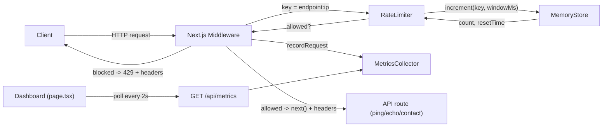

# API Rate Limiter — Project Overview

A small, production-shaped **API rate limiter** built on Next.js. It sits in front of your API routes, counts how many requests each client (IP) makes in a time window, and returns `429 Too Many Requests` once a limit is exceeded. It also records live metrics and renders them in a real-time dashboard.

This document explains **what the project is**, **how it's built**, and **what tools/techniques were used and why**.

---

## What it does

- Enforces per-endpoint request limits (e.g. `/api/ping` = 10/min, `/api/contact` = 3/10min).
- Isolates limits per client IP, so one abusive client can't affect others.
- Adds standard `X-RateLimit-*` headers to every response, and `Retry-After` on `429`.
- Tracks live metrics (total / allowed / blocked, active IPs, requests-per-second, per-endpoint stats, recent requests).
- Visualizes those metrics in a live-polling dashboard.

---

## Architecture at a glance



**Request flow:**
1. Middleware intercepts every `/api/*` request.
2. It extracts the client IP and picks the endpoint's limit config.
3. `RateLimiter` builds a key (`endpoint:ip`) and asks `MemoryStore` to increment the counter for the current fixed window.
4. If the count is within the limit, the request continues with rate-limit headers attached; otherwise it's blocked with a `429`.
5. Either way, the outcome is recorded in `MetricsCollector`.
6. The dashboard polls `GET /api/metrics` and renders the stats.

---

## Tech stack — what I used and why

| Tool / Technique | Where | Why I used it |
|---|---|---|
| **Next.js 15 (App Router)** | Whole app | Gives API routes, middleware, and a React frontend in one framework. Middleware is the natural place for a cross-cutting concern like rate limiting. |
| **Next.js Middleware (Node.js runtime)** | `src/middleware.ts` | Runs before every `/api/*` route, so limits are enforced in one place. Uses the **Node runtime** (not Edge) so it shares in-memory singletons with the route handlers. |
| **TypeScript** | Entire codebase | Interfaces (`RateLimitStore`, `RateLimitConfig`) define a clear contract so any storage backend (memory, Redis) is swappable safely. Catches mistakes at compile time. |
| **Fixed-window counter algorithm** | `src/lib/rate-limit/limiter.ts` | Simplest correct rate-limiting algorithm. Windows are aligned to the Unix epoch (`floor(now/windowMs)*windowMs`) so boundaries are predictable and don't drift per-request. |
| **In-memory `Map` store** | `src/lib/rate-limit/memory-store.ts` | Zero dependencies, instant to reason about, ideal for a single-process demo. Includes lazy cleanup on access plus a periodic sweep to avoid memory leaks. |
| **`globalThis` singletons** | `middleware.ts`, `metrics.ts` | Guarantees exactly one `MemoryStore` and one `MetricsCollector` per process, and keeps them alive across Next.js dev hot-reloads (which otherwise re-instantiate modules and lose state). |
| **`MetricsCollector` (separate class)** | `src/lib/rate-limit/metrics.ts` | Keeps observability out of the middleware's core logic. Tracks TTL'd active IPs and a rolling 60s window for requests/sec so memory stays bounded. |
| **React (client component) + Recharts** | `src/app/page.tsx` | Recharts is a standard, lightweight React charting lib that plays well with Next 15. A `use client` component lets `useEffect` poll `/api/metrics` for a live dashboard. |
| **Consistent response envelope** | `src/lib/api-response.ts`, `src/lib/api-errors.ts` | `ok()` / `fail()` helpers and typed `ApiError` classes keep every response uniformly shaped, so error handling (especially `429`) isn't scattered around. |
| **Config table** | `src/lib/rate-limit/config.ts` | Per-endpoint limits live in one editable table instead of being hard-coded in the middleware, so tuning limits never touches logic. |
| **Vitest** | `test/memory-store.test.ts` | Fast, TS-native test runner. Tests target the store's counter logic — the part most likely to silently break. |
| **Shared-secret auth on reset** | `src/app/api/metrics/route.ts` | `POST /api/metrics` (reset) requires an `X-Admin-Reset` header matching `ADMIN_RESET_KEY`, so random clients can't wipe the dashboard. |

---

## Key design decisions (the "why" behind the shape)

- **Rate limiting in middleware, not in each route.** One guardrail covers all endpoints; route handlers stay focused on business logic and never run when a request is blocked.
- **Node.js middleware runtime.** By default Next.js runs middleware in an isolated Edge runtime that can't share memory with Node route handlers — which would make the metrics singleton always read empty. Enabling `experimental.nodeMiddleware` + `runtime: "nodejs"` puts middleware and routes in the same process so they share the same counters and metrics.
- **Rate-limit headers set on the response, not the forwarded request.** `NextResponse.next({ request: { headers } })` only rewrites headers sent downstream; headers meant for the client must be set on the outgoing response object.
- **Fail-open on limiter errors.** If the limiter throws, the request is allowed through rather than breaking the site. For a public API, availability is prioritized over strict enforcement.
- **`x-forwarded-for` as the IP source — a documented trade-off.** Accurate behind a trusted proxy (Vercel/Cloudflare/nginx), but spoofable on direct connections. This is documented in `docs/security-IP-spoof.md` rather than hidden.
- **Interface-first storage.** The `RateLimitStore` interface means swapping the in-memory store for Redis is a drop-in change with no limiter/middleware edits.

---

## Project structure

```
API-limiter/
├── src/
│   ├── middleware.ts                  # Rate-limit enforcement (Node runtime)
│   ├── app/
│   │   ├── page.tsx                   # Live metrics dashboard (Recharts)
│   │   ├── layout.tsx
│   │   └── api/
│   │       ├── ping/route.ts          # GET, 10/min
│   │       ├── echo/route.ts          # POST, 5/min
│   │       ├── contact/route.ts       # POST, 3/10min
│   │       └── metrics/route.ts       # GET stats, POST reset (auth)
│   └── lib/
│       ├── api-response.ts            # ok() / fail() envelope
│       ├── api-errors.ts              # ApiError + tooManyRequests()
│       ├── utils.ts                   # validateEmail()
│       └── rate-limit/
│           ├── types.ts               # RateLimitStore / Config / Result
│           ├── memory-store.ts        # In-memory fixed-window store
│           ├── limiter.ts             # Core algorithm
│           ├── config.ts              # Per-endpoint limits
│           ├── metrics.ts             # MetricsCollector singleton
│           └── index.ts               # Barrel exports
├── test/memory-store.test.ts          # Vitest unit tests
├── docs/                              # Design + security notes
├── next.config.js                     # experimental.nodeMiddleware
└── package.json
```

---

## Running and testing

```bash
npm install
npm run dev        # http://localhost:3000 (dashboard)
npm test           # Vitest unit tests
npm run build      # production build
```

Quick manual checks:

```bash
# Rate-limit headers on an allowed request
curl -i http://localhost:3000/api/ping

# Trigger a 429 (11th request in a minute)
for i in $(seq 1 11); do curl -s -o /dev/null -w "%{http_code}\n" http://localhost:3000/api/ping; done

# Per-IP isolation (each IP has its own counter)
curl -H "x-forwarded-for: 1.2.3.4" http://localhost:3000/api/ping

# Live metrics (what the dashboard polls)
curl http://localhost:3000/api/metrics
```

---

## Known limitations (intentional for this scope)

- **Single process only.** In-memory counters aren't shared across multiple instances; multi-server deployments need a Redis-backed store (the `RateLimitStore` interface is ready for it).
- **`x-forwarded-for` is spoofable without a trusted proxy** — see `docs/security-IP-spoof.md`.
- **Basic email regex** in `validateEmail` — good enough to catch typos/bots, not RFC-complete.
- **Reset auth is a shared secret** — fine for a demo; real deployments should use proper auth.
